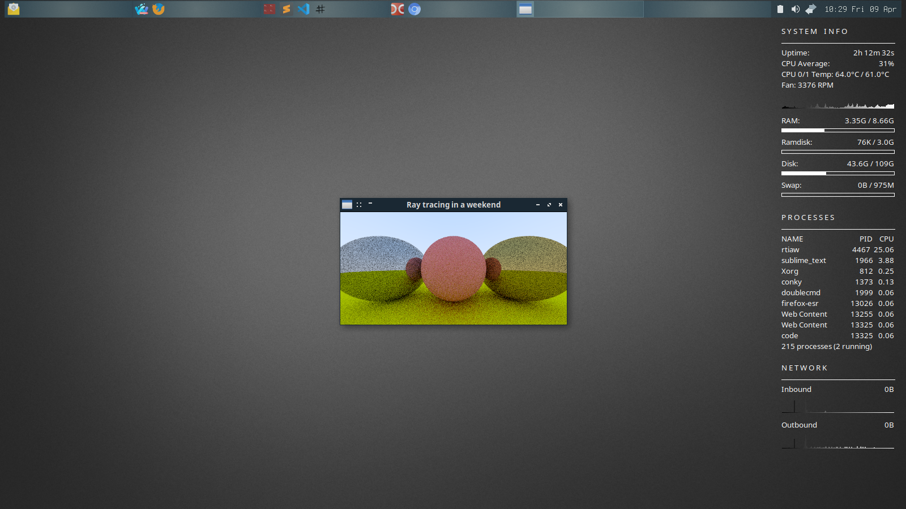

# Ray Tracing in a Weekend

### About

D language implementation of [Ray Tracing in a Weekend](https://raytracing.github.io/)

### Screenshot



## Requirements

Compile-time dependencies:

- D language compiler (tested  on DMD64 D Compiler v2.083.0)
- DUB (optionally)

## Compilation

Navigate to a project directory and execute:
```
dub build
```

## Usage

```
./rtiaw
```
